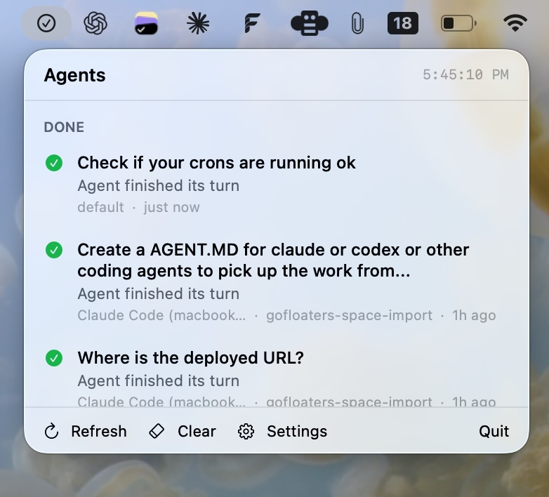
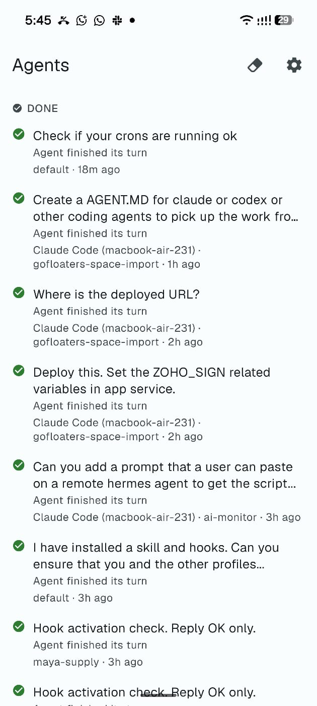

# Agent Status Monitor

See what every one of your AI coding agents is doing — Claude Code, Codex,
Hermes, or anything else that can run a shell command — whether it's running
on your laptop or on a server across the world. Get notified the moment one
finishes or needs you.

<table>
<tr>
<td width="60%"></td>
<td width="40%"></td>
</tr>
</table>

A macOS menu bar app and an Android app both read the same board. Agents
write to it with one CLI command, wherever they happen to be running.

## Install

```bash
curl -fsSL https://raw.githubusercontent.com/gigcompany/agent-status-monitor/main/install.sh | bash
```

Or clone it and pick a backend up front:

```bash
git clone https://github.com/gigcompany/agent-status-monitor.git
cd agent-status-monitor
cp .env.example .env   # edit it, then:
./install.sh --hooks --login
```

The installer links the skill into every agent runtime it finds on the
machine, installs the `agent-status` CLI, builds the menu bar app (macOS
only), and verifies the backend connection before finishing.

Run `./install.sh --help` for every flag.

## How it works

Three layers, in order of how much they can do without your help:

1. **`SKILL.md`** — Claude Code, Codex, Hermes, and Cursor all read the same
   frontmatter skill format, so one symlinked directory teaches all of them
   at once: *"here's how and when to report status."*
2. **The `agent-status` CLI** — the layer everything else is built on. A
   single Python file, stdlib only, no `pip install` needed. Any agent that
   can run a shell command can report, including ones this project has never
   heard of.
3. **Lifecycle hooks** — fully automatic reporting, no model cooperation
   required. Currently wired for **Claude Code** (`UserPromptSubmit` /
   `Notification` / `Stop`) and **every Hermes profile** (`pre_llm_call` /
   `post_llm_call`). Other runtimes fall back to layer 2: the skill teaches
   the model to call the CLI itself, which is reliable but not automatic.
   See [`TODO.md`](TODO.md) for hook support on other harnesses.

```
  agent ──(agent-status CLI)──> backend (local SQLite by default, or Supabase)
                                     │
                       polled every few seconds by
                                     │
                     ┌───────────────┴───────────────┐
              macOS menu bar app              Android app
           (native notifications)          (pull to refresh)
```

## Setting up your laptop

This is the machine you actually want to look at — where the menu bar app
(and/or the Android app) lives.

```bash
git clone https://github.com/gigcompany/agent-status-monitor.git
cd agent-status-monitor
./install.sh --hooks --login
```

- `--hooks` wires up automatic reporting for Claude Code and Hermes (see
  [below](#hermes-multiple-profiles) if you run more than one Hermes
  profile)
- `--login` starts the menu bar app at login
- The installer asks which backend to use if you haven't set one in `.env`
  first — **local is the default**: no account, no keys, works the moment
  you run the command. Only switch to Supabase if you need the board to
  reach beyond this one Mac (see [Backends](#backends) below).

Any agent you run *on this same laptop* — Claude Code, Codex, a local Hermes
instance — is wired up by this one command, and shows up on the board with
zero cloud setup. Agents running elsewhere (a cloud VPS, a spare machine)
need the separate step below, **and** a cloud backend - `local` cannot
reach them, by design (it's a file on this one Mac).

### Android app

A read-only companion app lives in [`mobile/`](mobile) — Expo, Material You
theming, same board. See [`mobile/README.md`](mobile/README.md) to build and
run it. **It needs the `supabase` backend, not `local`** — a phone cannot
read a SQLite file that lives on your Mac. If you only care about the menu
bar app, `local` is fine and this doesn't apply.

## Setting up a cloud server or remote agent box

Anywhere your agents actually *run* — a VPS, a droplet, a spare Linux box —
needs the CLI, not the app. Run this directly on that machine (SSH in first
if it's remote):

```bash
curl -fsSL https://raw.githubusercontent.com/gigcompany/agent-status-monitor/main/install.sh -o install.sh
AGENT_STATUS_SUPABASE_URL="https://xxx.supabase.co" AGENT_STATUS_SUPABASE_KEY="your-anon-key" bash install.sh --backend supabase --hooks --no-app
```

Use the *same* Supabase project and key as your laptop, so both machines
write to one board. Two things worth knowing about this exact form:

- **It's two separate commands on purpose.** Piping `curl` straight into
  `bash` with flags after it is a classic footgun — the flags can end up
  going to `curl` instead of the script, which just fails with `curl:
  option --no-app: is unknown`. Downloading first sidesteps that entirely.
- **The credentials are real environment variables**, not `.env` file
  contents — that's what lets this run non-interactively in one shot. If
  you paste them as separate `VAR="value"` lines instead of on the same
  line as `bash install.sh`, they won't reach the script (no `export`, so
  they're invisible to the child process) - it'll just fall back to
  prompting you interactively instead, which still works fine if you're at
  a real terminal, just isn't one shot.

`--no-app` skips the menu bar app entirely — it's macOS-only, and most
servers have no GUI. `--hooks` wires lifecycle hooks into every Hermes
profile it finds on that machine, not just `default`.

### Easiest of all: have an agent already on that box do it

If there's already an AI agent running on the remote server with shell
access - a Hermes profile, Claude Code, Codex, whatever - paste it
[**this prompt**](REMOTE-AGENT-PROMPT.md) instead of typing commands
yourself. It runs the install above, then does the Hermes-specific
follow-up every profile needs (approve the hooks, restart any gateway that
was already running, verify each one actually went clean) - across however
many profiles are on that box, without you typing any of it by hand.

## Backends

Pick one with `AGENT_STATUS_BACKEND` in `.env` (or let the installer ask).
**Two ship today, on purpose** — every backend is a real maintenance burden
(wire format, auth, rate limits, a real account to test against), and this
project would rather have two that work than five that might. See
[Adding a backend adapter](#adding-a-backend-adapter) if you want a third.

| Backend | Setup | Spans machines | Android app | Cost |
|---|---|---|---|---|
| **`local`** *(default)* | none | no | ✗ can't reach it | free |
| **`supabase`** | run one SQL file | yes | ✓ | free tier |

### `local` — the default: no account, no keys, works immediately

SQLite at `~/.agent-status/status.db`. Every agent on that one machine
writes to it in WAL mode, so a dozen of them can report concurrently without
corrupting it. Since a local file read is free, the menu bar app polls it
every 2 seconds instead of 5.

This is enough for the common case: Claude Code, Codex, and Hermes all
running on your own laptop, watched by the menu bar app on that same laptop.
**The limitation is real, though: it cannot span machines.** If any of these
are true, you need `supabase` instead:

- You want the **Android app** to show anything (a phone cannot read a file
  that lives on your Mac)
- You have agents on a **remote server or VPS** you want on the same board
- You run **more than one Mac** and want one shared board

### `supabase` — spans machines, required for mobile, free tier

1. Create a project at [supabase.com](https://supabase.com) — free tier, no
   card required.
2. Open **SQL Editor** → New query → paste
   [`backends/supabase/schema.sql`](backends/supabase/schema.sql) → Run.
3. **Project Settings → API** → copy the **Project URL** and the
   **anon / public** key (not `service_role` — see
   [Security](#security)).
4. Put both in `.env`, or answer the installer's prompts, or switch later:
   `./install.sh --backend supabase`.

The schema enables Realtime on the table already, for when the polling
viewers become websocket-based (see [`TODO.md`](TODO.md)).

### Adding a backend adapter

See [`CONTRIBUTING.md`](CONTRIBUTING.md#adding-a-backend-adapter) for the
full walkthrough — what the three methods are, and a worked example (Azure
Cosmos, which this project shipped and later removed - see below) plus notes
on what a Firestore adapter would look like.

**Why Cosmos isn't here anymore:** an earlier version of this project
supported Azure Cosmos DB, built and verified against a real account.
It was removed to keep the shipped surface to backends the maintainers can
actually keep working - not a statement that Cosmos itself doesn't work.
The code is preserved as a reference implementation in CONTRIBUTING.md; a PR
that brings it back with tests is welcome.

## Connecting different agent runtimes

The CLI is universal (`agent-status start/update/wait/done/fail/list`,
same on every runtime — see [Reporting from an agent](#reporting-from-an-agent)),
but *automatic* reporting depends on each runtime's own hook system.

### Claude Code

`--hooks` wires three hooks into `~/.claude/settings.json` (backed up first):

| Hook | Effect |
|---|---|
| `UserPromptSubmit` | Creates the task from your own prompt text — the session shows up even if the model never calls the CLI |
| `Notification` | Claude needs permission or input → task becomes **waiting**, you get notified |
| `Stop` | Claude finished its turn → task becomes **done** (unless it's `waiting` — see below) |

`Stop` deliberately leaves a `waiting` task alone: you still owe it an
answer, and closing it would drop the question off the board.

**Self-healing for orphaned tasks:** if a `Stop` hook never fires for some
reason (a crashed process, hooks that changed mid-session), the next task
that agent starts will automatically close out anything still `working` and
untouched for 30+ minutes. It will *not* close a task that's still being
actively updated — two genuinely concurrent Claude Code windows on the same
machine don't fight over one board row.

### Hermes (multiple profiles)

Hermes profiles (`hermes profile create <name>`) are completely separate
trees, each with its own `config.yaml` and skill directory — the installer
loops over **every profile it finds**, not just `default`. Because Hermes
tracks hook approval by the script's file modification time, editing the
script (updating this project) invalidates every profile's approval until
you re-approve:

```bash
hermes -p <profile> --accept-hooks     # once per profile, after any update
hermes -p <profile> gateway restart    # if that profile's gateway is running
```

`hermes hooks doctor` will tell you if a profile's approval has gone stale.

One thing worth knowing: `hermes hooks doctor` / `hermes hooks test` **really
execute the hook** as a smoke test, using a canned payload with
`session_id: "test-session"`. This project filters that exact marker out, so
running diagnostics on your own wiring never pollutes the board — if an
agent runs `hooks doctor` on its own initiative (e.g. to answer "are you
wired up?"), that's a safe thing to do.

### Codex

Codex has exactly one global `notify` slot in `config.toml`, and it's often
already claimed by something else (Computer Use, another tool). The
installer will not touch it, so Codex currently reports through the skill
only (layer 2 above) — reliable, but the model has to remember to call the
CLI. PRs adding a safer Codex hook integration are welcome.

### Anything else

If it can run a shell command, it can report:

```bash
agent-status start "Add Stripe refund endpoint"
agent-status wait --question "Refund partial amounts, or full-only for v1?"
agent-status done --summary "POST /refunds live, 8 tests passing"
```

Add its skill directory to the loop in `install.sh` and it gets the same
one-command install everything else does.

## Reporting from an agent

```bash
agent-status start  "Add Stripe refund endpoint"
agent-status update --detail "Endpoint done, writing tests" --step 2 --total 3
agent-status wait   --question "Refund partial amounts, or full-only for v1?"
agent-status done   --summary "POST /refunds live, 8 tests passing"
agent-status fail   --error "Stripe webhook secret missing in staging"

agent-status list --hours 6    # what every agent is doing
agent-status config            # resolved settings, keys redacted
```

No task ID to track — the CLI remembers the active task per session, keyed
on the runtime's own session ID (falling back to the working directory), so
parallel agents in one repo don't clobber each other.

## Configuration

One file, `~/.agent-status/config.env`, read by the CLI **and** both apps —
they can never disagree. The menu bar app re-reads it every poll, so edits
take effect without restarting anything. Copy `.env.example` to `.env` and
edit before installing, or let the installer write it from your answers.

Any value can be overridden by a real environment variable, which is how one
machine reports as several distinct agent identities:

```bash
AGENT_STATUS_AGENT_ID=hermes@scraper \
AGENT_STATUS_AGENT_LABEL="Hermes (scraper)" \
  agent-status start "Crawl pricing pages"
```

See [`.env.example`](.env.example) for the full list with defaults.

## Status model

| Status | Meaning | Notifies |
|---|---|---|
| `working` | Actively running | no |
| `waiting` | Blocked on you | **yes** |
| `done` | Finished | yes (configurable) |
| `failed` | Stopped on an error | **yes** |

A task still `working` with no update for 30 minutes shows as **stale**
rather than trusted — an agent that crashes cannot report its own death.

Finished tasks are kept 48h and active ones 7 days by default
(`AGENT_STATUS_TTL_HOURS`, `AGENT_STATUS_DONE_TTL_HOURS`). Agents sweep
expired rows opportunistically on write, so there's no cleanup job to run.

## Notifications

The menu bar app requests native notification permission first. macOS
refuses that to apps it hasn't notarized, so it falls back to `osascript`,
which always works — notifications then appear attributed to Script Editor
rather than Agent Status Monitor. Notification text is passed to `osascript`
as arguments, never interpolated into script source, so agent-authored text
can't inject AppleScript.

Sign and notarize the bundle with a Developer ID and the native path takes
over automatically, no code change needed.

## Security

- **The Supabase anon key is shared with every agent host.** It grants
  read/write to anyone holding it, under a permissive RLS policy. Use a
  dedicated project, not one with anything sensitive already in it. `local`
  has no equivalent risk - nothing ever leaves the machine.
- Config files are written `0600`. The remote install does put the anon key
  on that machine's own command line and shell history, since you're typing
  it directly into a terminal you're already SSHed into or an agent is
  already running in - fine for a box only you administer, worth knowing if
  it isn't.
- **Task text leaves your machine** on `supabase`. Keep secrets out of task
  descriptions, or use `local`, where nothing leaves the machine at all.
- Revoking one remote agent means rotating the shared key and re-running the
  installers. For per-agent revocation, switch to Supabase Auth (not built
  yet — see [`TODO.md`](TODO.md)).

## Development

```bash
cd menubar
swift build -c release
./build-app.sh              # assemble + sign AgentMonitor.app

log stream --predicate 'subsystem == "com.gofloaters.agentmonitor"' --info --debug
```

`build-app.sh` signs with an Apple Development identity when it finds one
and falls back to ad-hoc.

For the mobile app, see [`mobile/README.md`](mobile/README.md).

## Contributing

See [`CONTRIBUTING.md`](CONTRIBUTING.md).

## Roadmap

See [`TODO.md`](TODO.md) for what's planned and up for grabs.

## License

MIT
